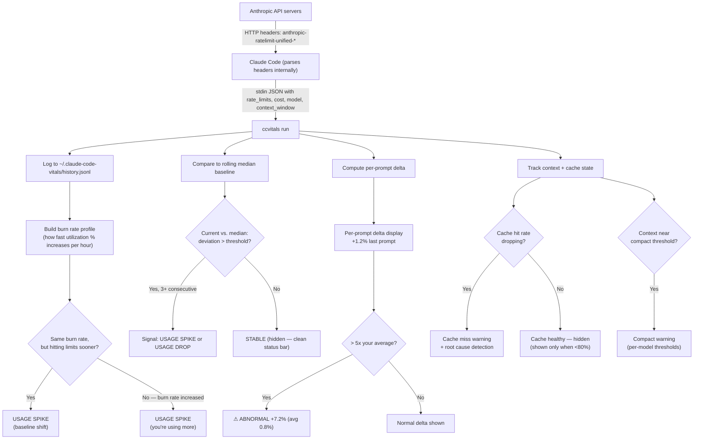

# claude-code-vitals

**Know your limits before they know you.**

A passive, always-on rate limit monitor for Claude Code. Tracks drift, predicts depletion, detects cache resets, and tells you when to switch models. Zero token cost. Zero external dependencies.


Percentages are color-coded: **green** (<50% used), **yellow** (50-80%), **red** (>80%).

## The Problem

You're deep in a coding session. Claude starts responding slower, or cuts off early, or just stops working. You have no idea if:
- You used too much quota today
- Your rate limit ceiling shifted without warning
- There's a temporary throttle during a model transition
- It's a peak hour penalty you didn't know about
- Your cache just reset and you're burning 5x more budget

Existing tools show current usage. Nobody tracks whether the **ceiling itself changed**, predicts when you'll run out, or watches your prompt cache health.

## Install

```bash
pipx install claude-code-vitals
ccvitals init
# Restart Claude Code — done.
```

Or with pip:
```bash
pip install claude-code-vitals
ccvitals init
```

That's it. `ccvitals init` configures your Claude Code status bar automatically.

## What You See

### Normal (single row)
```
Opus 4.6  |  5h: 87% left  |  7d: 84% left  |  resets 2h 17m
```

### Running low (two rows)
```
Opus 4.6  |  5h: 25% left  |  7d: 12% left  |  resets 1h 20m
  runs out 45m  |  try Sonnet (96% left)
```

### Usage spike (two rows)
```
Opus 4.6  |  ⚠ USAGE SPIKE +25%  |  5h: 32% left  |  7d: 12% left
  3.2x avg  |  ⚠ PEAK ends 2h  |  since 3h ago
```

### Cache problem (two rows)
```
Opus 4.6  |  5h: 87% left  |  7d: 84% left  |  resets 2h 17m
  ctx: 72% (144k)  |  Cache: 34%  |  ⚠ CACHE MISS — idle 6min
```

### Multi-Row Progressive Disclosure
Row 1 always shows essentials (model, percentages, countdown). Row 2 appears only when something needs attention (alerts, cache issues, depletion warnings). Clean when everything is fine.

## How It Works



### The key insight

Every interaction with Claude Code generates a reading. Over time, claude-code-vitals builds your **burn rate** -- how fast your utilization increases per hour of usage.

- **Same burn rate + hitting limits sooner** -- the ceiling shifted. You're using the same amount but getting less headroom.
- **Higher burn rate + hitting limits at the same time** -- your consumption increased. The ceiling is unchanged.

This is how claude-code-vitals separates a ceiling shift from a behavior change -- with math, not guesswork.

## Features

### Rate Limit Intelligence
- **Drift detection** -- rolling median baseline comparison with attribution ("you're using more" vs. "baseline shift")
- **Four signals** -- USAGE SPIKE (yellow), USAGE DROP (blue), COLLECTING (building baseline), STABLE (hidden)
- **Per-model tracking** -- each model (Opus, Sonnet, Haiku) has its own independent rate limit pool
- **Burn rate + depletion prediction** -- "runs out 45m" based on your current consumption rate (red <60min, yellow <5hr)
- **Hourly comparison** -- "3.2x avg" shown when burning >1.5x faster than your 7-day hourly median
- **Model switch suggestions** -- "try Sonnet (96% left)" when your current model is >70% used
- **Reset countdown** -- time until your 5-hour window resets

### Per-Prompt Delta
- **+2.3% last prompt** shown after every response
- **Abnormal spike detection** -- red warning when a single prompt costs >5x your average

### Context + Cache Intelligence
- **Context tracking** -- "ctx: 48% (96k)" with color-coded percentage
- **Cache hit rate** -- shown only when degraded (<80%); hidden when healthy to keep the bar clean
- **Cache miss detection** -- identifies root cause when cache drops
- **Compact warnings** -- alerts before auto-compaction resets your cache chain
- **Idle gap warnings** -- notifies when 5-minute cache TTL is at risk

All cache/context elements use progressive disclosure -- they only appear when something needs your attention.

### Peak Hours + Patterns
- **Peak hour detection** -- warns during 5am-11am PT weekdays with countdown
- **Color-coded urgency** -- green (<50% used), yellow (50-80%), red (>80%)
- **Cost display** -- "$3.50" session cost (toggleable)

### Passive by Design
- **Zero API calls** -- reads data Claude Code already provides
- **Zero token cost** -- purely passive observation
- **Zero external dependencies** -- pure Python standard library, runs in <50ms

### Progressive Disclosure
The status bar shows only what matters right now. When everything is fine, you see 4 elements. Alerts, cache warnings, and switch hints only appear when they need your attention. For the full picture anytime: `! ccvitals status --all-models`.

## Commands

```bash
ccvitals init                           # One-time setup
ccvitals status                         # Show current drift analysis
ccvitals status --all-models            # Show all models at once
ccvitals status --show-readings         # Include readings count
ccvitals status --show-remaining        # Show remaining % instead of used %
ccvitals compare                        # Usage trending (default: this session)
ccvitals compare --global               # Usage trending across all sessions
ccvitals budget                         # Session capacity (default: this session)
ccvitals budget --global                # Session capacity across all sessions
ccvitals suggest                        # Ranked model availability with burn rates
ccvitals suggest --session              # Model availability for this session only
ccvitals baseline --session             # Baseline from this session only
ccvitals status --session               # Status for this session only
ccvitals explain                        # Full status bar guide
ccvitals explain cache                  # Prompt cache mechanics
ccvitals explain compact                # Auto-compaction + cache chain breaks
ccvitals explain peak                   # Peak hours (5am-11am PT weekdays)
ccvitals explain models                 # Model differences + pool separation
ccvitals config list                    # View all settings
ccvitals config set <key> <value>       # Change any setting
ccvitals report                         # Generate HTML trend report
ccvitals privacy                        # View privacy policy
ccvitals uninstall                      # Remove configuration
ccvitals --version                      # Show version
```

## Configuration

View and change settings from the CLI -- no file editing needed:

```bash
ccvitals config set show_remaining true    # Show remaining % instead of used
ccvitals config set show_readings true     # Show readings count in status bar
ccvitals config set show_cost true         # Show session cost ($) in status bar
ccvitals config set show_pattern true      # Show time-of-day patterns
ccvitals config set all_models true        # Always show all models in status
ccvitals config set compact true           # Single-line or expanded view
ccvitals config set show_source true       # Show data source in status bar
ccvitals config set threshold_pct 15       # Adjust drift sensitivity
ccvitals config set color false            # Disable ANSI color output
ccvitals config list                       # See all current settings
```

All settings live in `~/.claude-code-vitals/config.toml`:

```toml
[tracking]
baseline_window_days = 7       # Rolling window (1-84 days)
threshold_pct = 10             # % deviation to trigger signal
debounce_count = 3             # Consecutive readings to confirm

[display]
compact = true                 # Single-line (true) or expanded (false)
show_pattern = true            # Show time-of-day patterns
show_remaining = false         # true = show 88% left, false = show 12% used
show_readings = false          # Show readings count in status bar
all_models = false             # Show all models in status command
show_cost = false              # Show session cost ($) in status bar
show_source = false            # Show data source in status bar
color = true                   # ANSI color output
```

## Session Tracking

claude-code-vitals tracks your Claude Code session ID to give accurate per-session metrics. Commands default to the most useful scope:

| Command | Default | Override |
|---------|---------|---------|
| `compare` | `--session` | `--global` |
| `budget` | `--session` | `--global` |
| `suggest` | `--global` | `--session` |
| `baseline` | `--global` | `--session` |
| `status` | `--global` | `--session` |

**Known limitation:** Session detection is best-effort. The current session ID is saved to a file during each status bar refresh. With multiple concurrent sessions, `--session` may occasionally show data from a different session. For most reliable results, run `!` commands immediately after a Claude Code response.

## Architecture

```
Claude Code -> stdin JSON -> ccvitals
                              |-> logger.py    (append to history.jsonl)
                              |-> detector.py  (rolling median + drift + burn rate)
                              |-> renderer.py  (ANSI status bar + cache + delta)
                              +-> oauth.py     (fallback enrichment)
```

**Zero external dependencies.** Pure Python standard library. Runs in <50ms.

## Key Discoveries

Things we learned by watching the data that Anthropic doesn't document:

- **Separate rate limit pools** -- each model has its own independent rate limit pool. Switching models gives you a fresh 5-hour window.
- **Opus costs 3-5x more** -- Opus consumes roughly 3-5x more rate limit budget per request than Sonnet.
- **5-minute cache TTL** -- prompt cache entries expire after 5 minutes of inactivity. Taking a break costs money on your next prompt.
- **Auto-compact resets cache** -- when Claude Code auto-compacts your context, the entire cache chain resets. The first prompt after compaction is expensive.

See `ccvitals explain cache` and `ccvitals explain models` for details.

## Data Stored

Each observation in `~/.claude-code-vitals/history.jsonl`:
```json
{
  "ts": "2026-03-30T14:22:00Z",
  "provider": "anthropic",
  "model_id": "claude-opus-4-6",
  "model_name": "Opus 4.6",
  "session_5h_pct": 42.0,
  "weekly_7d_pct": 67.0,
  "source": "statusline"
}
```

## Privacy

**Everything stays local.** Nothing is sent anywhere. No analytics, no telemetry, no phone-home.

Future versions may add opt-in anonymous crowdsourcing (utilization percentages only -- never prompts, keys, or identity). See `ccvitals privacy` for details.

## Roadmap

- [x] Phase 1: Local monitoring + drift detection with attribution
- [x] Per-model tracking (Opus, Sonnet, Haiku tracked independently)
- [x] Reset countdown + color-coded thresholds
- [x] CLI config management (`config set/list`)
- [x] Session cost display
- [x] Self-documenting (`ccvitals explain` with subtopics)
- [x] Burn rate + depletion prediction
- [x] Per-prompt delta + abnormal spike detection
- [x] Hourly comparison ("3.2x avg")
- [x] Model switch suggestions
- [x] Phase 2: Context + cache intelligence
- [x] Cache hit rate monitoring with per-model thresholds
- [x] Compact warnings + idle gap detection
- [x] Peak hour detection (5am-11am PT)
- [x] `suggest` and `budget` commands
- [ ] Multi-provider support (OpenAI, Google)
- [ ] Crowdsourced baseline (solve cold-start problem)
- [ ] Public dashboard

## Why This Exists

> 15+ GitHub issues on the Claude Code repo requesting rate limit visibility in the statusline. Multiple community workarounds built. Users reverse-engineering undocumented OAuth endpoints. The demand is overwhelming.

claude-code-vitals goes further: it doesn't just show you where you are now. It tracks changes over time, predicts when you'll run out, watches your cache health, and flags when something shifted -- the only tool that does all of this.

## License

MIT

## Author

[Jatin Mayekar](https://github.com/jatinmayekar)
